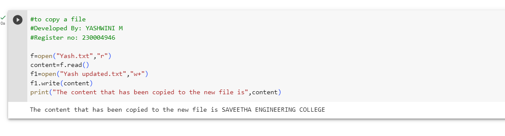

# copy-file
## AIM:
To write a python program for copying the contents from one file to another file.
## EQUIPEMENT'S REQUIRED: 
PC
Anaconda - Python 3.7
## ALGORITHM: 
### Step 1:
Create a file using notepad with extension .txt

### Step 2:
Open google colab and mount the drive for using the created file 
 
### Step 3: 
Now open the text file in read mode

### Step 4: 
Then read the content in the file in read mode 

### Step 5: 
Now open the new uncreated or an empty file using a different fileby "w+" then derived from first file using write().

### Step 6: 
End of program

## PROGRAM:
```
#to copy a file
#Developed By: YASHWINI M
#Register no: 230004946

f=open("Yash.txt","r")
content=f.read()
f1=open("Yash updated.txt","w+")
f1.write(content)
print("The content that has been copied to the new file is",content)
```

### OUTPUT:


.


## RESULT:
Thus the program is written to copy the contents from one file to another file.